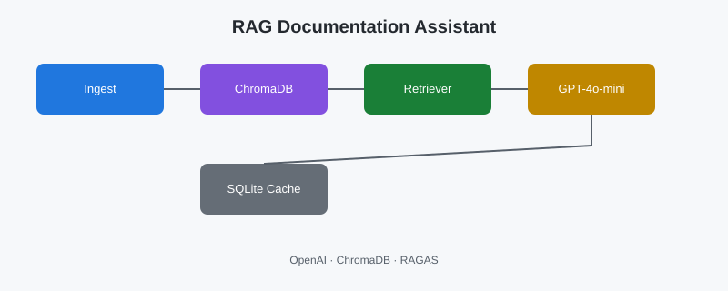

# Case Study: RAG Documentation Assistant

**Showcase:** [rag-documentation-assistant](https://github.com/alexanderomobile/rag-documentation-assistant/blob/main/README.en.md)
**Status:** ✅ Production

---

## Problem

Console RAG assistant for technical documentation.

## Features

Knowledge-base Q&A, semantic search, response cache, RAGAS quality metrics.

## Business value

Cuts doc lookup time, reduces support load, lowers risk of answers from memory instead of sources.

## Stack

See showcase README.

## Modules

Ingest · Search · Delivery · Integrations

## Screenshots

## Run

See showcase README for run instructions.

---

[← Back to portfolio](https://github.com/alexanderomobile/portfolio/blob/main/README.en.md)
