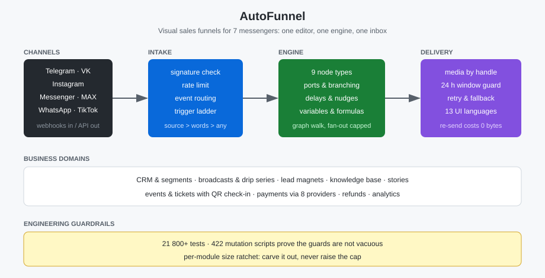

🇷🇺 [Русский](../ru/10-autofunnel.md) · 🇬🇧 [English](../en/10-autofunnel.md) · 🇪🇸 [Español](../es/10-autofunnel.md)

# Case Study: AutoFunnel

**Live:** https://autofunnel.optimum-ltd.com/
**Status:** ✅ Production · first production tenant, real end customers

---

## Problem

Small businesses need sales funnels inside messengers, but every platform works differently:
its own webhooks, buttons, sending windows and media limits. Building one funnel means either
paying for seven separate services or hand-writing the integrations.

AutoFunnel is one visual editor, one engine and one inbox across seven channels.

## Features

Visual funnel editor (nine node types: message, condition, action, data collection, payment,
booking, A/B test, formula, note), triggers on keywords, comments, stories, source tags,
schedule and payment, CRM with segments, broadcasts and drip series, lead magnets, knowledge
base, event ticketing with QR check-in, payments through eight providers plus refunds,
a unified inbox with operator replies, and a cabinet in thirteen languages.

## Business value

Replaces seven separate integrations with one cabinet: a funnel is drawn with the mouse and
behaves the same in Telegram, Instagram and the rest. Money goes straight to the owner's
account — the platform takes no cut of turnover and never holds funds.

## Stack

Python 3.11 · FastAPI · MariaDB · vanilla JS (no bundler) · systemd · LXC · Cloudflare Tunnel ·
Telegram Bot API · Meta Graph API (Instagram, Messenger, WhatsApp) · VK Callback API · MAX API ·
MTProto (Telethon) for stories

## Functional blocks

Channels · Funnel editor · Engine · CRM · Broadcasts · Tickets · Payments · Analytics · Inbox

## Engineering decisions

**A precedence ladder for triggers.** An event goes to the trigger that says the most about it:
source tag → keywords → catch-all. Without it a single catch-all swallows every other scenario —
which is exactly what happened once on production data.

**Media is sent by handle, not by file.** After the first send the platform returns its own id
for the uploaded file, and every later send passes that id. Measured on a live 50 MB video:
94 s → 0.5 s, zero bytes uploaded.

**Decisions read properties, not text.** Meta localises error messages, so string matching works
in English and silently breaks in Arabic. Every such branch reads numeric codes instead.

**A per-module size ratchet.** Each module has its own cap; when it runs out, a domain is carved
into a new module — the threshold is never raised. Twice in the project's history the cap was
*lowered* after a carve-out, so the freed space could not be quietly consumed again.

**Mutation testing as an acceptance condition.** Twenty-one thousand tests prove nothing by
themselves: a test verified only by a green run is a description, not a guard. 422 scripts each
break exactly one rule and are required to turn red.

## Scale

| | |
|---|---|
| Modules | 460 server-side + 217 front-end |
| Tests | 21,800+ across 691 files |
| Mutation scripts | 422 |
| Database tables | 60 |
| Design documents | 193 |
| UI languages | 13 |

## Screenshots

## In progress

Meta business verification to lift the WhatsApp and Messenger limits · public ticket storefront ·
per-event report and guest export · offline ticket check-in · named tickets · ticket page in every
cabinet language.

---

[← Back to portfolio](https://github.com/alexanderomobile/portfolio/blob/main/README.md)
