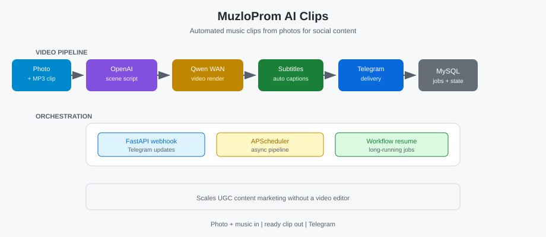

🇷🇺 [Русский](../ru/05-muzloprom-ai-clips.md) · 🇬🇧 [English](../en/05-muzloprom-ai-clips.md) · 🇪🇸 [Español](../es/05-muzloprom-ai-clips.md)

# Case Study: MuzloProm AI Clips

**Showcase:** [muzloprom-ai-clips](https://github.com/alexanderomobile/muzloprom-ai-clips/blob/main/README.es.md)
**Status:** ✅ Production

---

## Problema

Clips musicales con IA desde fotos.

## Funcionalidad

Foto + MP3 → escena OpenAI → video Qwen WAN → subtítulos → Telegram.

## Valor de negocio

Escala marketing de contenido sin editor; UGC rápido para redes sociales.

## Stack

See showcase README.

## Módulos

Ingest · Search · Delivery · Integrations

## Capturas

## Ejecución

See showcase README for run instructions.

---

[← Volver al portfolio](https://github.com/alexanderomobile/portfolio/blob/main/README.es.md)
