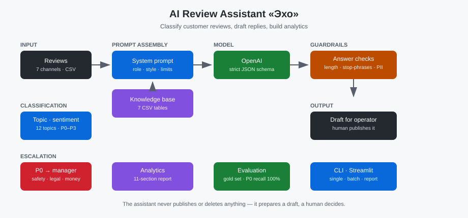

🇷🇺 [Русский](../ru/08-ai-review-assistant.md) · 🇬🇧 [English](../en/08-ai-review-assistant.md) · 🇪🇸 [Español](../es/08-ai-review-assistant.md)

# Case Study: AI Review Assistant «Echo»

**Showcase:** [ai-review-assistant](https://github.com/alexanderomobile/ai-review-assistant/blob/main/README.es.md)
**Status:** ✅ Production

---

## Problema

Asistente IA para gestionar reseñas de clientes.

## Funcionalidad

Clasificación por tono y tema, borradores de respuesta por plantillas, escalado P0–P3, informe analítico, validaciones de respuesta.

## Valor de negocio

Reduce la gestión de una reseña de 6 a 1 minuto, mantiene un tono único y no deja escapar reseñas críticas.

## Stack

See showcase README.

## Módulos

Clasificación · Base de conocimiento · Borradores · Escalado · Analítica · Validaciones

## Capturas

## Ejecución

See showcase README for run instructions.

---

[← Volver al portfolio](https://github.com/alexanderomobile/portfolio/blob/main/README.es.md)
