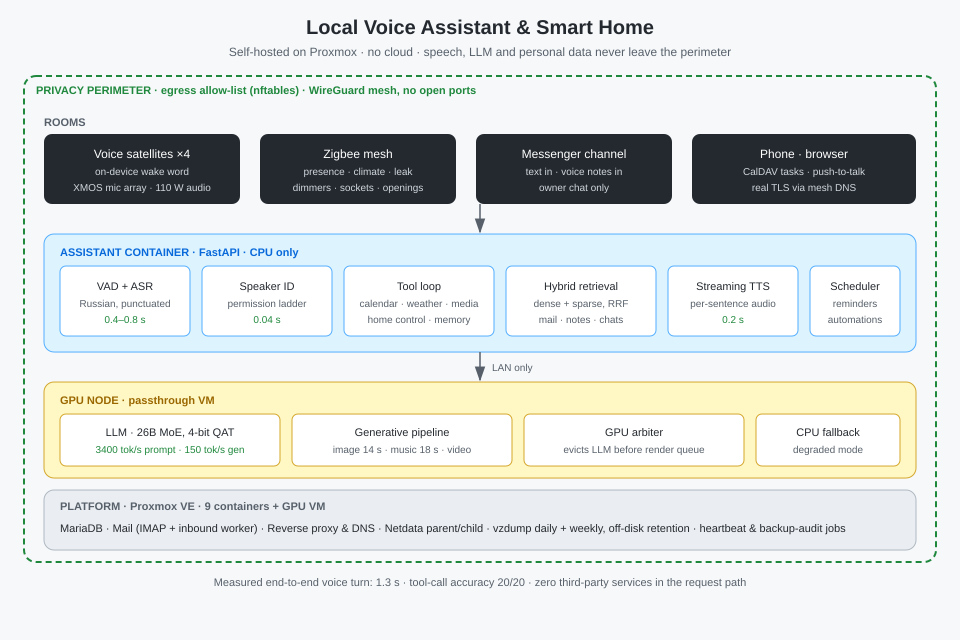

🇷🇺 [Русский](../ru/09-local-voice-assistant-smart-home.md) · 🇬🇧 [English](../en/09-local-voice-assistant-smart-home.md) · 🇪🇸 [Español](../es/09-local-voice-assistant-smart-home.md)

# Case Study: Asistente virtual local y hogar inteligente

**Showcase:** [local-voice-assistant](https://github.com/alexanderomobile/local-voice-assistant/blob/main/README.es.md)
**Status:** ✅ Production

---

## Problema

Un asistente de voz y un hogar inteligente que funcionan **íntegramente sobre hardware propio**. Ni la transcripción del habla, ni el contenido del correo, ni el calendario, ni los mensajes privados salen jamás del perímetro doméstico, y aun así el sistema iguala a los altavoces comerciales en prestaciones y los supera en varios escenarios.

Un requisito adicional: el asistente comparte una única GPU con la cadena generativa en producción de otro proyecto y **debe cederla sin fallos**.

## Funcionalidad

**Voz.** La palabra de activación se detecta en el propio dispositivo; después, recorte de silencio, reconocimiento de habla en ruso con puntuación, llamada a herramientas por parte del modelo de lenguaje y síntesis en streaming frase a frase: la primera suena mientras la segunda todavía se genera.

**Reconocimiento del hablante.** La huella de voz se compara con las referencias registradas en 40 ms y determina los permisos: el propietario obtiene todo, las personas de confianza un conjunto limitado, y una voz desconocida no accede a datos personales. Por diseño, la voz nunca autoriza acciones irreversibles.

**Datos personales.** Calendario y tareas por CalDAV con sincronización al teléfono y edición sin conexión, recordatorios por voz y por mensajería, memoria de conversación y búsqueda híbrida sobre correo, notas y chats.

**Hogar.** Malla Zigbee: iluminación regulable con temperatura de color ajustable, sensores de presencia, clima, fugas y apertura, enchufes inteligentes y escenas según presencia y hora del día. Control por voz, texto y automatizaciones.

**Generación.** Imágenes, música y vídeo renderizados en la GPU local a partir de una petición hablada, entregados por mensajería.

## Valor de negocio

Demuestra que una infraestructura de IA privada se construye sobre hardware de consumo sin suscripciones en la nube y sin renunciar a funciones: la misma clase de tareas que los asistentes comerciales, con cero salida de datos y un coste de propiedad predecible. La arquitectura se traslada directamente a entornos corporativos donde los datos no pueden abandonar el perímetro.

## Stack

**Plataforma.** Proxmox VE 9, nueve contenedores LXC y una máquina virtual con GPU en passthrough. Instantáneas diarias de contenedores y semanales de la VM, retención en disco aparte, auditoría automática de copias y vigilancia de disponibilidad de los invitados.

**Modelo de lenguaje.** llama.cpp sobre Vulkan, modelo de clase 26B en modo MoE con cuantización QAT: 3800 millones de parámetros activos por token. Un servicio aparte en CPU actúa como vía de emergencia.

**Cadena de voz.** FastAPI, GigaAM (reconocimiento), Silero (síntesis y VAD), WeSpeaker en ONNX (huella de voz), todo en CPU para no competir con la GPU.

**Datos.** Radicale (CalDAV), SQLite para el estado, Qdrant con BGE-M3 para búsqueda híbrida: vectores densos y dispersos fusionados con RRF, evitando los problemas de morfología del BM25 clásico en ruso.

**Infraestructura.** MariaDB, Dovecot y Postfix con correo entrante a través de un worker de borde y un túnel, nginx y DNS en la pasarela, Netdata en topología parent/child, malla WireGuard con certificados reales y sin un solo puerto abierto a internet.

**Hogar.** Coordinador Zigbee, Zigbee2MQTT, satélites ESPHome, API local de iluminación.

## Decisiones de ingeniería

**Arbitraje de la GPU.** Detectar el trabajo de render ajeno vigilando la memoria de vídeo llega tarde: para entonces la memoria ya está tomada y el trabajo falla. Se colocó un guardián delante de la cola de render que expulsa el modelo de lenguaje, espera a que se libere la memoria y solo entonces admite el trabajo. La condición de carrera se elimina por construcción, no se mitiga. También se resolvió un detalle poco evidente: el motor generativo no libera la memoria de vídeo al terminar, por lo que la devolución del modelo va precedida de una descarga explícita de pesos.

**Restricción de salida.** El contenedor del asistente solo alcanza tres destinos externos de una lista blanca que se refresca por temporizador; todo lo demás se descarta. Incluso comprometido por completo, el contenedor no tiene adónde enviar datos.

**Defensa frente a inyección de instrucciones.** El texto del correo y de los chats se entrega al modelo como datos, nunca como instrucciones; las herramientas son de solo lectura; enviar y borrar exige confirmación explícita mostrando el destinatario; los remitentes sensibles no se indexan en absoluto, porque leer ese mensaje ya es la fuga.

**Separación de canales.** Cada canal mantiene su propia memoria de conversación: el diálogo hablado y el hilo de mensajería nunca se mezclan.

**Degradar en vez de fallar.** Mientras la GPU está cedida al render, el asistente anuncia abiertamente el modo lento y sigue funcionando con el modelo en CPU.

## Bloques funcionales

Reconocimiento de habla · Huella de voz y permisos · Ciclo de herramientas · Búsqueda híbrida · Síntesis en streaming · Calendario y recordatorios · Hogar inteligente · Generación de medios · Arbitraje de GPU · Perímetro y monitorización

## Métricas

| métrica | valor |
|---|---|
| Turno de voz completo | **1,3 s** (reconocimiento 0,79 · modelo 0,22 · síntesis 0,20) |
| Reconocimiento del hablante | 0,04 s; voz propia 0,63–0,75 frente a ajenas 0,10–0,27 |
| Precisión en llamadas a herramientas | **20 de 20** en las frases habituales del propietario |
| Modelo de lenguaje | 3400 tok/s de entrada, 150 tok/s de generación |
| Generación de imagen / música | 14 s / 18 s |
| Devolución de la GPU al asistente | 112 s tras vaciarse la cola |

## Capturas

## Ejecución

La infraestructura está descrita de forma declarativa y se despliega en cualquier nodo Proxmox con una sola GPU de clase 16 GB. Los detalles de configuración no se publican: el sistema da servicio a un perímetro privado.

---

[← Volver al portafolio](https://github.com/alexanderomobile/portfolio/blob/main/README.es.md)
