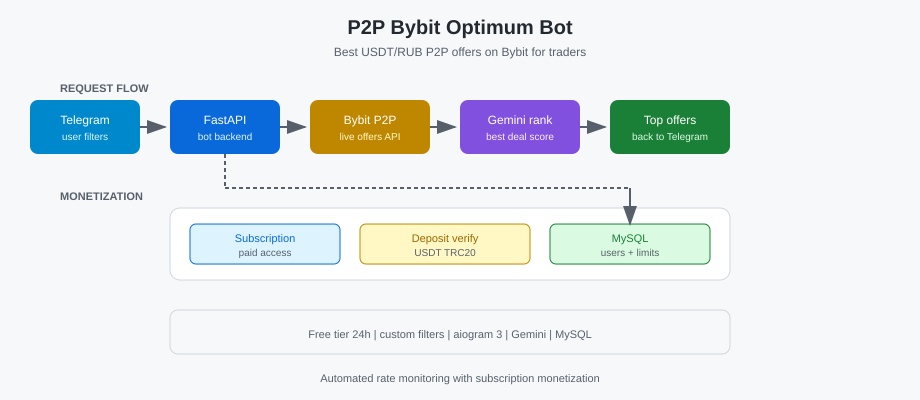

# Case Study: P2P Bybit Optimum Bot

**Showcase:** [github.com/alexanderomobile/p2p-bybit-optimum](https://github.com/alexanderomobile/p2p-bybit-optimum)
**Status:** ✅ Production

---

## Задача

Поиск лучших P2P USDT/RUB на Bybit.

## Функционал

Фильтры, Bybit API, ранжирование Gemini, подписка, проверка депозитов.

## Польза для бизнеса

Автоматизирует мониторинг курса для трейдеров; монетизация через подписку.

## Стек

See showcase README.

## Функциональные блоки

Ingest · Search · Delivery · Integrations *(details in repo showcase)*

## Скриншоты

## Запуск

See showcase README for run instructions.

---

[← К портфолио](../../README.md)
