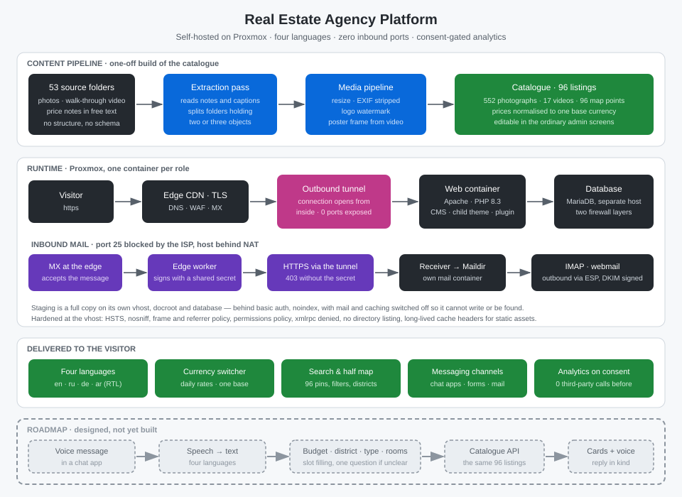

🇷🇺 [Русский](../ru/10-real-estate-agency-platform.md) · 🇬🇧 [English](../en/10-real-estate-agency-platform.md) · 🇪🇸 [Español](../es/10-real-estate-agency-platform.md)

# Case Study: Платформа агентства недвижимости

**Status:** ✅ Production

---

## Задача

Агентство недвижимости на побережье Красного моря продавало объекты через мессенджеры и папки с фотографиями. Сайт формально существовал: купленная тема с демонстрационным наполнением — адрес в Майами, шестьсот выдуманных объектов, форма обратной связи, писавшая разработчику темы. Ни одного настоящего объекта.

Требовалось за один заход: перенести всё на собственную инфраструктуру, собрать настоящий каталог из сырого материала, довести сайт до состояния, в котором его принимают на проверку рекламные платформы, — и при этом получить возможность продолжать разработку, не превращая боевой сайт в верстак.

Отдельное условие: агентство работает с покупателями из четырёх языковых групп, включая арабскую с письмом справа налево, и торгуется в трёх валютах.

## Функционал

**Каталог.** 96 объектов, 552 фотографии, 17 видео, точка на карте у каждого. Галерея, видео с обложкой, характеристики, цена. Всё редактируется владельцем в обычных экранах админки — без программиста.

**Поиск.** Фильтры по району, типу, статусу, комнатам, площади и цене; отдельная страница «все объекты на карте» с кластеризацией и синхронным списком.

**Четыре языка.** Интерфейс, юридические страницы, письма и подписи на английском, русском, немецком и арабском, включая полноценный RTL-режим. Объекты при этом намеренно не переводятся: один каталог обслуживает все четыре версии.

**Мультивалютность.** Базовая валюта одна, курсы обновляются ежедневно, посетитель смотрит цены в своей. На карточке — оговорка, что пересчитанная сумма справочная, а в договор идёт цена в базовой валюте.

**Каналы связи.** Телефон, почта и три мессенджера — в шапке, в подвале, на карточке объекта и в меню «поделиться», с рабочими ссылками на всех языках.

**Аналитика с согласия.** До ответа на баннер в браузер не уходит ни один сторонний запрос. Параллельно считается посещаемость по журналу самого веб-сервера — без cookie и без выгрузки наружу.

**Закулисная копия.** Полная копия сайта на своём поддомене, со своей базой, под паролем, закрытая от индексации, с отключённой отправкой почты — чтобы правки проверялись на живых данных, но не могли ни попасть в поиск, ни написать клиенту.

## Польза для бизнеса

Агентство получило витрину, которую можно показать покупателю и подать на проверку платформы: настоящий каталог вместо демонстрационного, контакты, по которым дозваниваются, и юридические страницы, соответствующие тому, что сайт делает на самом деле. Каталог ведётся своими силами. Инфраструктура — собственная: нет ни хостинга с абонентской платой, ни зависимости от чужого почтового сервиса, ни единого открытого порта наружу.

## Стек

**Платформа.** Proxmox, роль на контейнер: веб, база, почта, туннель, служебные задачи. Ежедневные снимки, восстановление проверено.

**Веб.** Apache с mod_php, PHP 8.3, CMS с готовой отраслевой темой, вся разработка — в дочерней теме и собственном плагине, родительская остаётся обновляемой.

**Периметр.** Соединение с внешним миром открывает сам сервер: туннель наружу, входящих портов нет вообще. TLS и DNS на пограничном узле, конфигурация маршрутов валидируется перед применением — ошибка в этом файле роняет сразу все сайты узла.

**Почта.** Провайдер закрыл 25-й порт, сервер за NAT. Входящая идёт через MX пограничного узла, обработчик подписывает сообщение общим секретом и отдаёт его по HTTPS через тот же туннель приёмнику; без секрета приёмник отвечает 403. Дальше Maildir, IMAP, веб-интерфейс. Исходящая — через транзакционный сервис с подписью DKIM.

**Данные.** MariaDB на отдельном узле, доступ ограничен на двух уровнях — фильтром внутри контейнера и правилами гипервизора.

**Обработка материала.** Python: Pillow для фотографий и документов, ffmpeg для кадров из видео, скрипты импорта на PHP через CLI платформы.

## Инженерные решения

**Каталог собран из того, что было.** Исходник — 53 папки: фотографии вперемешку с видео, цены в текстовых файлах и подписях к постам, половина папок содержит два-три разных объекта сразу. Разбор сделан веером независимых проходов: каждый читает свою папку, выделяет объекты, вытаскивает тип, площадь, комнаты, район и цену. Ловушки отлавливались явно: первый взнос — не цена, месячная аренда — не продажа, цена за метр — не цена объекта. Результат — 96 карточек вместо 24 и ни одной выдуманной характеристики.

**Фотографии обезврежены перед публикацией.** Снимки уменьшены, EXIF снят целиком — иначе геометка камеры уходит наружу вместе с адресом чужой квартиры, — и подписаны логотипом. Объектам без фотографий обложка взята кадром из видео на четверти длины: не с первой секунды, где камера ещё дрожит.

**Галерея хранилась не в том виде, в каком её читают.** Тема читает галерею как *несколько строк* мета-поля, а импорт записал одну строку со списком через запятую — и объект с 28 снимками показывал ровно один. Диагностику осложняло то, что штатное чтение мета идёт через фильтр совместимости, который приводит значение к числу и возвращает первый идентификатор: снаружи всё выглядело так, будто в базе действительно одна картинка. Пришлось читать таблицу напрямую.

**Объект — не переводимый контент.** Плагин мультиязычности считал объекты переводимыми, все 96 числились английскими, и в трёх языковых версиях из четырёх каталог, все архивы и карта были пусты. Снять галочку в настройках оказалось недостаточно: родительская тема объявляет свои типы переводимыми в собственном конфигурационном файле, и плагин слушается файла, а не настроек. Списки отфильтрованы в дочерней теме, на приоритете, который заведомо выше.

**Свой слой перевода вместо готового.** Поставляемые с темой каталоги переведены примерно наполовину и машинно: «Currency Switcher» в них «Валютный коммутатор», а подстановочные знаки разломаны в «% 2 $ s» — такой перевод портит страницу сильнее, чем английский текст. Написан свой слой на 253 строки на язык, покрывающий сразу четыре источника подписей: строки самой темы, значения в её настройках, названия таксономий и отдельные мета-поля объектов.

**Момент подстановки важнее самой подстановки.** Первая версия этого слоя висела на чтении настроек — то есть срабатывала ещё при загрузке, когда язык страницы неизвестен. Запасным языком была локаль самого движка, а она равнялась языку, на котором владелец читает админку. В итоге английские карточки объектов вышли с русскими заголовками, а служебные скрипты, читавшие и сохранявшие настройки, записали чужой язык в базу как исходный. Разбор занял вечер, восстановление — обратным отображением собственных словарей и значениями по умолчанию из темы; подстановка перенесена на момент, когда язык страницы уже определён. Урок стоил того, чтобы его записать: у любого перевода есть не только словарь, но и время срабатывания.

**`meta_key` — это внутреннее соединение.** Каталог сортируется «сначала рекомендуемые», и тема реализует это через `meta_key`. WordPress превращает `meta_key` в INNER JOIN — объект без такой строки не уходит в конец списка, а исчезает из выборки. У 15 объектов из 96 строки не было: архив по городу показывал «объектов не найдено» при трёх объектах в термине, архив по статусу — 75 из 90. Симптом выглядел как проблема с индексом, причина оказалась в отсутствующем поле.

**Поиск по цене умеет только базовую валюту.** Ползунок цены тема пересчитывает для показа, а в запрос отправляет те же пересчитанные числа — и сравнивает их с ценами, которые лежат в базовой валюте. При выбранном долларе поиск честно не находил ничего. Границы цены переводятся обратно перед выполнением запроса, по тем же дневным курсам.

**Обещание в тексте — часть кода.** Политика конфиденциальности прямым текстом обещала, что в браузере ничего не считается и что текст обновят *до* того, как это изменится. При подключении аналитики обещание наступило: восемь юридических страниц на четырёх языках переписаны в том же изменении, что и включение счётчика.

**Шрифты забраны к себе.** Каждая страница, включая те, что посетитель видит до ответа на баннер, запрашивала шрифты у стороннего CDN и отдавала ему адрес посетителя. 38 файлов перенесены на свой сервер; ссылки на внешний источник не переписываются, а отбрасываются на уровне подключения стилей — чтобы плагин, добавленный позже, не открыл канал заново.

**Проверка построена как состязательный стенд.** Готовность проверялась не обходом руками, а веером независимых проверяющих по направлениям — галереи, валюта, языки, аналитика, SEO, контакты, — и каждую заявленную находку проверял заново отдельный скептик, которому ставилась задача её опровергнуть. В зачёт шло только воспроизведённое. За два круга: 40 подтверждённых дефектов исправлено, 4 отклонены как не-дефекты — включая «обрыв текста», который оказался штатной работой шаблона.

## Функциональные блоки

Каталог · Медиаконвейер · Поиск и карта · Мультиязычность · Мультивалютность · Каналы связи · Согласие и аналитика · Юридический контур · Периметр и почта · Закулисная копия · Состязательная проверка

## Метрики

| показатель | значение |
|---|---|
| Объектов опубликовано | **96** из 53 папок сырого материала |
| Фотографий · видео · точек на карте | 552 · 17 · 96 |
| Языков интерфейса | **4**, включая RTL |
| Открытых входящих портов | **0** |
| Сторонних запросов до согласия | **0** |
| Дефектов найдено и исправлено проверкой | **40** подтверждённых, 4 отклонены |
| Объектов выпадало из выборки до исправления | 15 из 96 |
| Архивов отдавало пустой список | 3 |
| Файлов шрифтов перенесено к себе | 38 |
| Адресов в карте сайта, все отвечают 200 | 165 |

## Roadmap

Раздел описывает спроектированное, но **ещё не построенное**.

**Голосовой подбор объектов в мессенджере.** Покупатель наговаривает запрос — «двушка в таком-то районе до ста тысяч долларов» — и получает подборку карточек. Конвейер: голосовое сообщение → распознавание речи на четырёх языках → извлечение полей запроса языковой моделью (бюджет и валюта, район, тип, комнаты, продажа или аренда) → запрос к каталогу через уже существующий REST-слой → ответ карточками с фотографией, ценой в названной валюте и ссылкой на карту → синтез голосового ответа. Отдельный контейнер, вебхук через тот же туннель, входящих портов по-прежнему ноль. Два принципиальных решения заложены заранее: при неоднозначном запросе бот задаёт один уточняющий вопрос, а не угадывает; цена пересчитывается через те же дневные курсы, что и на сайте, чтобы бот и витрина никогда не расходились в цифрах.

**Сохранённые поиски и оповещения.** Подписка на условия подбора с письмом или сообщением, когда появляется подходящий объект.

**Воронка обращений.** Заявки с форм и из мессенджеров в одну ленту со статусами — вместо переписки, размазанной по четырём приложениям.

**Интеграция с бизнес-API мессенджера.** Шаблонные сообщения и подтверждения показов; требует пройденной проверки платформы — она в процессе.

**Оценка и дедупликация фотографий.** Автоматически отбрасывать дубли и снимки заведомо низкого качества при загрузке новой папки.

**Непрерывная проверка дочерней темы.** Линтер, проверка типов и дымовые тесты ключевых страниц на каждое изменение — сегодня эту роль выполняет состязательный стенд, запускаемый вручную.

**Content-Security-Policy.** Заголовок не выставлен намеренно: на этой связке тема плюс визуальный редактор его нельзя включить вслепую, нужна отдельная работа с проверкой каждого экрана.

## Скриншоты

## Запуск

Инфраструктура развёрнута на собственном узле Proxmox. Конфигурация, адреса и реквизиты не публикуются: система обслуживает работающий бизнес.

---

[← К портфолио](https://github.com/alexanderomobile/portfolio/blob/main/README.md)
